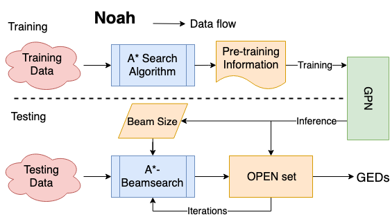

GraphEditDistance
============================================
This is the source code for paper "Noah: Neural-optimized A* Search Algorithm for Graph Edit Distance Computation" (ICDE 2021). 
<p align="center">
  
</p>
	
### Abstract
<p align="justify">
Graph Edit Distance (GED) is a classical graph similarity metric that can be tailored to a wide range of applications. However, the exact GED computation is NP-complete, which means it is only feasible for small graphs only. And therefore, approximate GED computation methods are used in most real-world applications. However, traditional practices and end-to-end learning-based methods have their shortcomings when applied for approximate GED computation. The former relies on experience and usually performs not well. The latter is only capable of computing similarity scores between graphs without an actual edit path, which is crucial in specific problems (e.g., Graph Alignment, Semantic Role Labeling). This paper proposes a novel approach Noah, which combines A* search algorithm and graph neural networks to compute approximate GED in a more effective and intelligent way. The combination is mainly reflected in two aspects. First, we learn the estimated cost function h(.) by Graph Path Networks. Pre-training GEDs and corresponding edit paths are also incorporated for training the model, therefore helping optimize the search direction of A* search algorithm. Second, we learn an elastic beam size that can help reduce search size and satisfy various user settings. Experimental results demonstrate the practical effectiveness of our approach on several tasks and suggest that our approach significantly outperforms the state-of-the-art methods.</p>

This repository provides a PyTorch implementation of Noah as described in the paper. 

Please cite our paper, if you use our source code.
```
@inproceedings{yang2021noah,
  title={Noah: Neural-optimized A* Search Algorithm for Graph Edit Distance Computation},
  author={Yang, Lei and Zou, Lei},
  booktitle={2021 IEEE 37th International Conference on Data Engineering (ICDE)},
  pages={576--587},
  year={2021},
  organization={IEEE}
}
```

### Requirements
```
munkres                   1.1.4 
networkx                  2.3
numpy                     1.13.3
pandas                    0.23.4
scikit-learn              0.20.0
pp                        1.6.4.4
pytorch                   1.3.1 
torch-cluster             1.4.5     
torch-geometric           1.3.2                 
torch-scatter             1.4.0                   
torch-sparse              0.4.3   
torchvision               0.2.1
tqdm                      4.40.2
```
### Datasets

The Datasets we use are AIDS and IMDB from [[SimGNN]](https://github.com/yunshengb/SimGNN); GREC from [[IAM Graph Database]](https://iapr-tc15.greyc.fr/IAM/download-the-iam-graph-database.html); and synthetic generated by [[networkx]](https://github.com/networkx/networkx). They are all stored as a GEXF or GXL, which can be parsed by **networkx** or **ElementTree**. Note that AIDS dataset is with node labels, while the other two datasets are not. The ground-truth GEDs can be downloaded [[here]](https://drive.google.com/file/d/1VVWGaSY9FI6wJEg_pDTBC6IJkhYKTyMp/view?usp=sharing), or you can generate them through scripts in the ``util`` folder.


### Options
Training a GPN model is handled by the `src/main.py` script which provides command line arguments explained in the `src/parser.py`.

### Usage
Generate pre-training GEDs:

``python util/ged_gen.py``

Training a GPN model:

``python src/main.py --arguments``

Run Noah:

``python src/ged.py GRAPH_1 GRAPH_2 Noah BEAMSIZE GEN_FLAG.``

Compare Noah with existing solutions on tasks (You need modify the script slightly):

``python src/main.py``


### Optional

We provide two ways for fine_tuning: first, you can revise the loss function and model layers with the initial state of the pre-trained model (i.e., the way used in elastic beam size); second, you can totally reuse the graph embeddings generated by the pre-trained model and build a downstream model (i.e., the way used in start node).

#### Elastic Beam Size

Generate elastic beam sizes:

``python util/sample_beam.py``

Fine_tuning GPN model (Need to reuse state_dict):

``python src/main.py --arguments``

#### Background Application


Run background flask:

``python simple.py``

Run front-end:

See [[here]](https://github.com/yangop8/GED)

#### Select Start Node
Generate start node training set:

``python util/start_gen.py``

Fine_tuning GPN model (Uncomment fine_tuning):

``python src/main.py``

### Getting Help

If you have any questions, please contact Lei Yang (yangop8@pku.edu.cn).